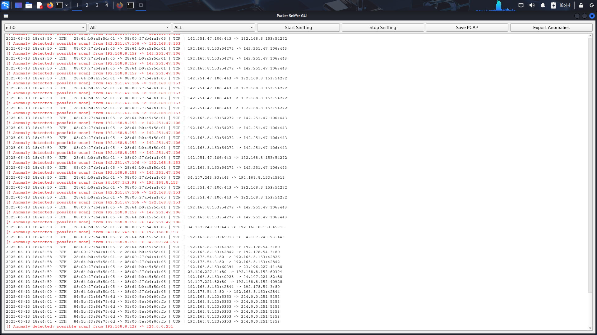
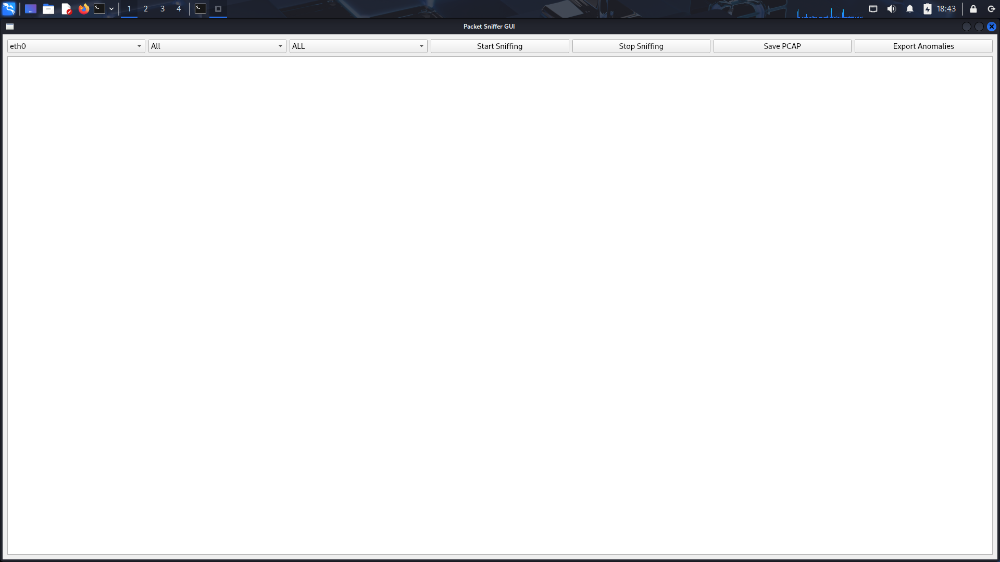

# Py-Pack-Sniff 🕵️‍♂️📡

**Py-Pack-Sniff** is a powerful and beginner-friendly network packet sniffer built with Python, PyQt5, and Scapy. It provides a graphical interface for capturing, filtering, analyzing, and exporting network packets in real time — ideal for learners, cybersecurity enthusiasts, and network troubleshooters.

---

## 🚀 Features

### 🎛️ Interface Controls
- **Network Interface Selection**: Choose from available interfaces on your system (e.g. `eth0`, `wlan0`).
- **Protocol Filter**: Live filter by protocol (`All`, `TCP`, `UDP`, `ICMP`, `DNS`).
- **Log Level Filter**: Toggle views between `ALL`, `INFO`, `WARNING`, or `ANOMALY`.

### 🔎 Packet Display
- Real-time logging of captured packets in a scrollable text display.
- Color-coded log highlighting:
  - 🟥 **Red**: Anomaly-detected packets.
  - ⚪ **White**: Normal packet logs.

### 🧠 Basic Anomaly Detection
- Detects port scans or suspicious packet bursts using a sliding time-window.
- Maintains a list of suspicious IPs based on repeated activity.

### 💾 Export & Save
- **Save PCAP**: Store captured packets in `.pcap` format for use in Wireshark or other tools.
- **Export Anomalies**: Save detected anomaly logs into a separate `.log` file for reporting or investigation.

---

## 🖥️ GUI Preview




---

## 📦 Installation

### 🐍 Prerequisites

Ensure Python 3.6+ is installed on your Linux system.

### 📥 Install dependencies

```bash
pip install -r requirements.txt

